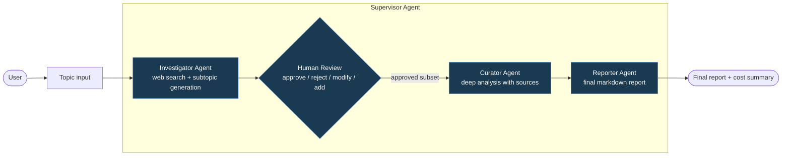

# Smart Content Research Assistant

> A console-based multi-agent research system with human-in-the-loop validation
> and adaptive cost optimization. Built with **LangGraph** + **Groq**.

The system orchestrates four specialized agents that collaborate to research
any topic: an **Investigator** that gathers initial sources from the web, a
**Curator** that synthesizes the approved findings, a **Reporter** that
produces a polished final report, and a **Supervisor** that coordinates the
workflow and manages the human-in-the-loop checkpoint.

The system intelligently routes tasks between cheaper and more powerful models
based on the complexity of each task, tracks token usage and cost in real time,
and presents the user with a transparent view of every routing decision.

---

## Table of contents

- [Features](#features)
- [Architecture](#architecture)
- [Tech stack](#tech-stack)
- [Setup](#setup)
- [Usage](#usage)
- [How the cost optimization works](#how-the-cost-optimization-works)
- [Design decisions](#design-decisions)
- [Project structure](#project-structure)

---

## Features

- **Four-agent pipeline** orchestrated through LangGraph, with checkpointed state
  and graceful interrupt/resume support.
- **Human-in-the-loop** validation via a CLI prompt with rich command parsing
  (`approve`, `reject`, `modify`, `add`, plus a numeric shortcut).
- **Real web search** through DuckDuckGo: subtopics are grounded in actual
  sources, not invented by the LLM.
- **Adaptive model routing** with a complexity classifier per agent: each task
  picks the cheapest model that can do it well, with traceable reasons.
- **Cost & token tracking** per agent, with a final cost-breakdown table and
  routing decisions panel rendered in the console.
- **Multilingual** by default: language detection chooses the response language
  automatically, supporting Spanish, English, and others.
- **Interactive session mode** with a `save` command to persist reports to
  disk as standalone Markdown files (including the usage summary).

---

## Architecture



### Roles

| Agent | Uses LLM? | Responsibility |
|---|---|---|
| **Investigator** | Yes (tier-routed) | Performs web search, proposes subtopics grounded in sources |
| **Curator** | Yes (tier-routed) | Deep analysis of approved subtopics using their associated sources |
| **Reporter** | Yes (tier-routed) | Produces the final, polished markdown report |
| **Supervisor** | **No** | Orchestrates the workflow and manages the interrupt/resume cycle |

The Supervisor deliberately does **not** use an LLM. Its decisions are
deterministic (run order, interrupt detection, state passing), so adding a
model would be costly without adding value. See
[Design decisions](#design-decisions) for the full rationale.

---

## Tech stack

| Concern | Choice | Why |
|---|---|---|
| Agent orchestration | **LangGraph** | First-class support for stateful workflows and `interrupt()` for human-in-the-loop |
| LLM provider | **Groq** | Free tier with no credit card, very fast inference, two clearly differentiated tiers |
| Models | `llama-3.1-8b-instant` (SIMPLE) and `llama-3.3-70b-versatile` (COMPLEX) | Cost gap of ~10× makes the routing meaningful |
| Web search | **DuckDuckGo** (via `ddgs`) | No API key required, runs out of the box |
| Schema validation | **Pydantic v2** | Strong typing for state and structured LLM outputs |
| Language detection | **langdetect** | Statistical n-gram detection, robust on short inputs |
| Console UI | **Rich** | Panels, tables, markdown rendering, spinners |

---

## Setup

### Prerequisites

- Python 3.12 or higher
- A free Groq API key from [console.groq.com/keys](https://console.groq.com/keys)

### Installation

```bash
# Clone the repository
git clone https://github.com/BungeSantiago/Smart_Content_Research_Assistant.git
cd Smart_Content_Research_Assistant

# Create a virtual environment
python3.12 -m venv .venv
source .venv/bin/activate  # On Windows: .venv\Scripts\activate

# Install dependencies
pip install -r requirements.txt

# Configure your API key
cp .env.example .env
# Edit .env and replace `your_groq_api_key_here` with your real key
```

### Verify the installation

```bash
python main.py "renewable energy in europe"
```

You should see the banner, the proposed subtopics with their sources, the
prompt for human review, and finally the report with the cost summary.

---

## Usage

### Single-shot mode

```bash
python main.py "topic to research"
```

The system runs once, presents subtopics, asks for your decision, generates
the report, and exits. At the end it asks if you want to save the report to
disk.

### Interactive mode

```bash
python main.py
```

Starts a session loop. After each research, you return to the menu and can:

- Type a new topic to research again.
- Type `save` to persist the **last** report to `reports/`.
- Type `exit` (or `quit`) to leave.
- Press `Ctrl+C` during a research to abort it without leaving the session.

### Human-in-the-loop commands

When the system pauses for review, you can combine commands separated by
commas:

| Command | Effect |
|---|---|
| `approve 1,3` | Approve subtopics 1 and 3 |
| `reject 2` | Reject subtopic 2 |
| `modify 4 to 'New title'` | Change the title of subtopic 4 |
| `add 'Another angle'` | Add a new subtopic, pre-approved |
| `1,3` | **Shortcut**: equivalent to `approve 1,3` |
| `approve 1, reject 2, add 'X'` | Combinations are supported |

Invalid IDs and conflicting actions trigger warnings, and the system insists
until it receives an applicable input — no silent failures.

### Saving reports

Reports are saved to `reports/<slug>_<timestamp>.md` and include the full
report plus a usage summary table with tokens and cost per agent.

---

## How the cost optimization works

The challenge asks for a system that "evaluates task complexity and chooses
the appropriate AI model". This is implemented in two layers:

### Layer 1: tiered model selection

Two tiers are defined in `core/llm.py`:

- **SIMPLE** → `llama-3.1-8b-instant` (~$0.05 / $0.08 per million in/out tokens)
- **COMPLEX** → `llama-3.3-70b-versatile` (~$0.59 / $0.79 per million in/out tokens)

The cost gap is roughly **10×**, so picking SIMPLE when adequate yields real
savings.

### Layer 2: per-agent complexity classifier

Located in `core/complexity_router.py`. Each agent calls the classifier with
signals from its actual workload:

- **Investigator**: based on the topic length (in words). Long, multi-concept
  topics earn the COMPLEX tier.
- **Curator**: based on the number of approved subtopics, the average
  rationale length, and the volume of associated source snippets. Light loads
  go to SIMPLE; heavy synthesis goes to COMPLEX.
- **Reporter**: based on the size of the curated content. Small payloads use
  SIMPLE; substantial content uses COMPLEX.

Every decision is logged with its reasoning and surfaced to the user in the
"Routing decisions" panel at the end of each run. This makes the optimization
**transparent**, not magic.

### Tracking

Each LLM call is wrapped in `core/llm_tracking.py`, which captures input/output
tokens, computes the estimated cost via `core/pricing.py`, and appends a
`UsageEntry` to the global state. The final summary table is rendered by
`core/cost_summary.py`.

---

## Design decisions

A few non-obvious choices worth highlighting:

### The Supervisor does not use an LLM

The four-agent structure includes a Supervisor as a coordinator. Unlike the
other three, the Supervisor's decisions are entirely deterministic: it
orchestrates the LangGraph workflow, detects interrupts, invokes the
human-review callback, and reassembles the final result. Adding an LLM there
would introduce stochasticity and cost without solving any actual problem.
The class lives in `agents/supervisor.py` and acts as a **facade** over
LangGraph, isolating presentation code (`main.py`) from orchestration logic.

### Subtopics are grounded in real web sources

Initial versions had the Investigator hallucinate subtopics from its training
data alone. The current implementation performs a real DuckDuckGo search
**first**, passes the results to the LLM as context, and asks it to organize
them into thematic subtopics, attaching the supporting source indices to each.
This means subtopics are anchored to real, verifiable URLs — and the Curator
later uses these sources to ground its analysis.

### Language detection migrated from heuristics to `langdetect`

The first version used a hand-rolled heuristic (special characters + common
Spanish stopwords). It worked for typical inputs but failed on short Spanish
phrases without accents (e.g., `"Como hacer un buen mate"` was classified as
English). Migrating to `langdetect` solved this with negligible overhead.

### The classifier considers *both* subtopics and sources

When real web sources were added, the original classifier (which only looked
at subtopic count and rationale length) became outdated: even simple cases
crossed its thresholds because of the snippet text. The classifier signature
was extended to also consider the number of sources and average snippet
length, giving more accurate tier decisions.

### Structured outputs use `json_mode`, not `function_calling`

Llama 3.1 8B (the SIMPLE tier) had unreliable tool-calling behavior with
LangChain's default `function_calling` mode, occasionally returning malformed
tool-call syntax. Switching to `json_mode` and embedding the JSON schema
directly in the prompt is more robust for smaller models and produces the
same end result.

---

## Project structure

```
Smart_Content_Research_Assistant/
├── agents/                    # The four agents
│   ├── investigator.py        # Web search + subtopic generation
│   ├── curator.py             # Deep analysis of approved subtopics
│   ├── reporter.py            # Final markdown report
│   └── supervisor.py          # Orchestration facade (no LLM)
├── core/                      # Shared infrastructure
│   ├── state.py               # Pydantic models for the shared state
│   ├── graph.py               # LangGraph wiring
│   ├── llm.py                 # Model factory + tier definitions
│   ├── llm_tracking.py        # Token/cost tracking around LLM calls
│   ├── pricing.py             # Model price catalog
│   ├── complexity_router.py   # Per-agent tier classifier
│   ├── cost_summary.py        # Console rendering of the cost table
│   ├── human_parser.py        # Human input parser with validation
│   ├── human_review.py        # Human-in-the-loop graph node
│   └── report_saver.py        # Markdown report persistence
├── tools/
│   └── web_search.py          # DuckDuckGo wrapper
├── prompts/                   # System prompts per agent (Markdown)
├── tests/                     # Unit tests
├── reports/                   # Saved reports (gitignored)
├── main.py                    # CLI entry point
├── requirements.txt
├── .env.example
└── README.md
```

---

## License

MIT.

## Author

Built by **Santiago Bunge**.